# cloud\zad1

## Zadanie 1: Stworzenie programu oraz przesłanie go na repo

Działający program oraz wynik dzialania

```
void main() {
  print('Juliusz Piskor, IMST 2.3');
  print('fib.exe');
  print('-----------');
  int n;
  print('Wprowadź numer > 0  i  < 20');
  String? inTemp = stdin.readLineSync();

  try {
    n = int.parse(inTemp!);
    if (n > 20) {
      print('Numer jest za duży!');
      return;
    }
  } catch (e) {
    log(e.toString());
    return;
  }
  print(fib(n));
}

int fib(int n) {
  if (n < 2) {
    return n;
  }
  return fib(n - 2) + fib(n - 1);
}
```

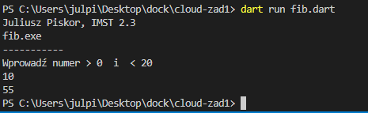

Dodanie do lokalnego repo, commit oraz push na gh repo

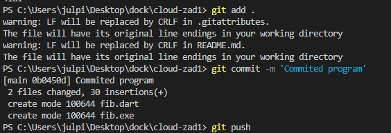

## Zadanie 2: Dodanie dockerfile oraz zbudowanie kontenera

### A:
Treść wykorzystywanego dockerfile

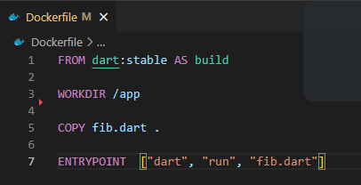

### B:
Budowanie obrazu:

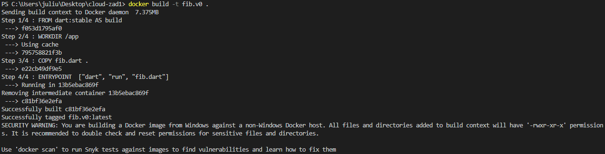

### C:
Uruchomienie kontenera i przetestowanie programu:

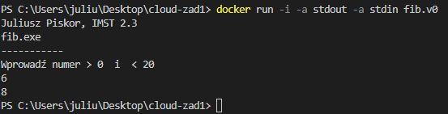

## Zadanie 3: GH Actions

Przygotowany plik fib.yml
```
name: GitHub Action for zad1 (fib)

on:
  push:
    branches: [main]
    tags: [v*]

jobs:
  build-push-images:
    name: build and push
    runs-on: ubuntu-20.04
    steps:
      - name: Checkout code
        uses: actions/checkout@v3

      - name: Buildx
        uses: docker/setup-buildx-action@v2

      - name: QEMU
        uses: docker/setup-qemu-action@v2

      - name: DockerHub
        uses: docker/login-action@v2
        with:
          username: ${{ secrets.DOCKER_HUB_USERNAME }}
          password: ${{ secrets.DOCKER_HUB_ACCESS_TOKEN }}

      - name: GitHub
        uses: docker/login-action@v2
        with:
          registry: ghcr.io
          username: ${{ github.actor }}
          password: ${{ secrets.PAT }}

      - name: Docker meta
        id: meta
        uses: docker/metadata-action@v4
        with:
          images: |
            itskck/cloud-zad1
            ghcr.io/${{ github.repository }}
          tags: |
            type=ref,event=branch
            type=ref,event=pr
            type=semver,pattern={{version}}
            type=semver,pattern={{major}}.{{minor}}
      - name: Build and push
        uses: docker/build-push-action@v3
        with:
          context: .
          file: ./Dockerfile
          platforms: linux/amd64, linux/arm64
          push: true
          tags: ${{ steps.meta.outputs.tags }}
          labels: ${{ steps.meta.outputs.labels }}
          cache-from: type=registry,ref=docker.io/itskck/cloud-zad1:cache
          cache-to: type=registry,ref=docker.io/itskck/cloud-zad1:cache,mode=max
```
Na początku wykonywane są akcje buildx oraz quemu, dzięki czemu obraz zbudowac sie może na dwie (lub więcej) architektury. Następnie wykonują sie wymagane do wykonania zadanie logowania: do dockerhuba oraz ghcr, przy pomocy secretsów umieszczonych w repo. Na końcu następuje zbudowanie i spushowanie.

Obrazy dostępne są na dwóch platformach, co widoczne jest na GitHub packages:
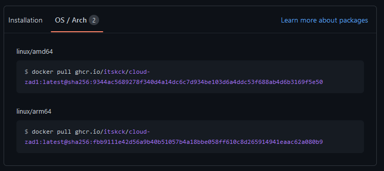

oraz na DockerHubie:
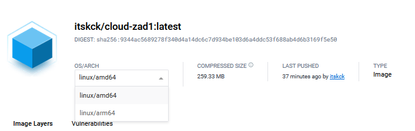

Za cachowanie odpowiadają flagi cache-from oraz cache-to. Cache jest wysyłany do registry.

Tagowanie:
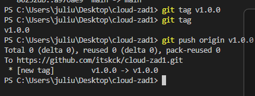

Tagi zostały dodane zgodnie z nazewnictwej SEMVER na GitHubie oraz DockerHubie. Dodany został tag o początku 'v', więc workflow włącza się automatycznie. Odpowiada za to nastepująca linia Dockerfila:

```
push:
    branches: [main]
    tags: [v*]
```

Workflowy przechodzą poprawnie:
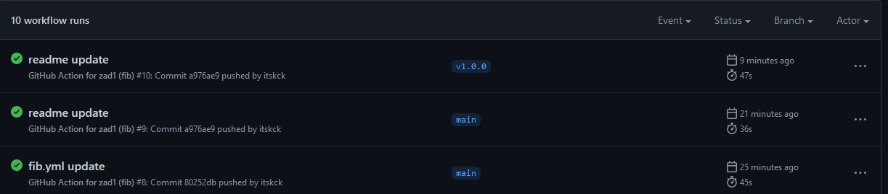

Wynik działania widoczny jest na packages: 
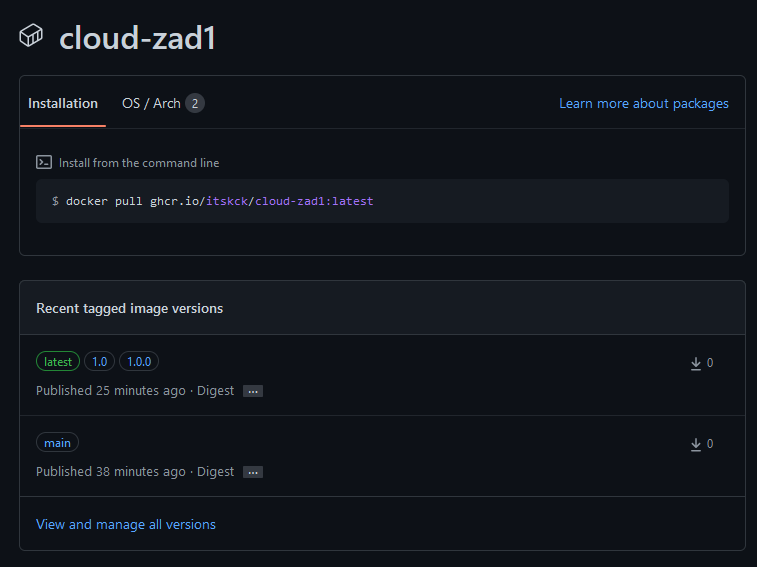

oraz na DockerHubie:

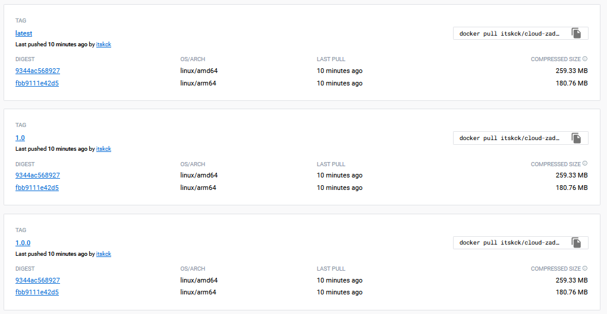

## Zadanie 4

Komenda 
```
gh workflow list
```
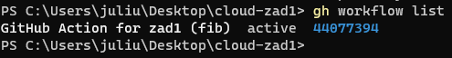

Workflowy oraz ich status dostępnę są w zakładce Actions na repo. Ostatni workflow dla maina i dla wczesniej utworzonego taga przeszedł poprawnie.

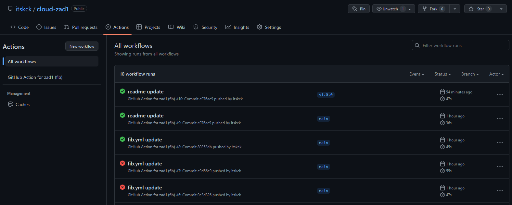

Poprawność wykonania kroków jest widoczna na screenach w zadaniu 3.

Żeby pobrać obrazu z repozytorium wykorzystana była komenda widoczna na ghcr:
```
docker pull ghcr.io/itskck/cloud-zad1:latest@sha256:9344ac5689278f340d4a14dc6c7d934be103d6a4ddc53f688ab4d6b3169f5e50
```
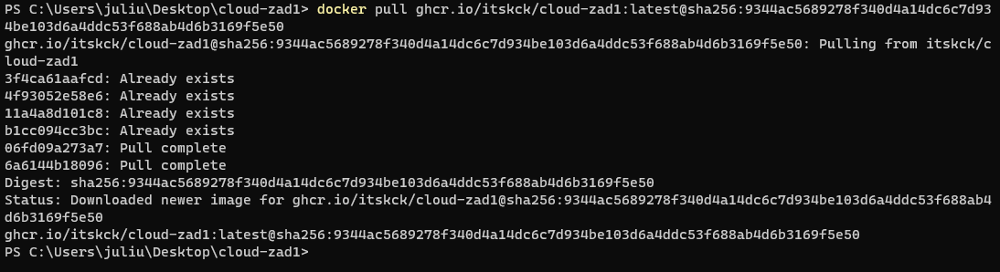

Uruchomienie obrazu:

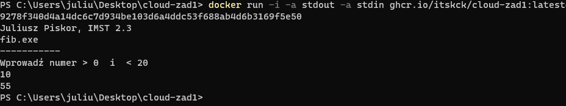


